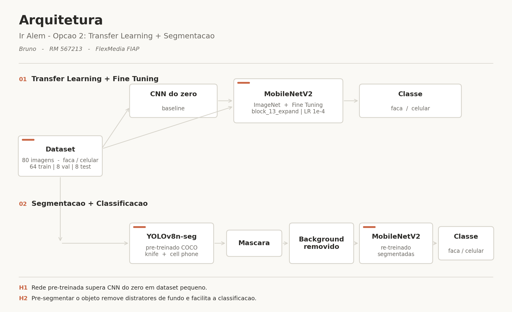

# Ir Além — Transfer Learning + Segmentação

**PBL Fase 6 — Ir Além - Opção 2** (seção 3.2 do enunciado)

---

## Conteúdo desta pasta

```
ir_alem/
├── Bruno_RM567213_pbl_fase6_iralem.ipynb            # notebook executado (com outputs)
├── Bruno_RM567213_pbl_fase6_iralem.template.ipynb   # notebook limpo (reprodução no Colab)
├── README.md                                        # este arquivo
├── arquitetura.png                                  # figura autoral da arquitetura
└── fiap_dataset.zip                                 # dataset p/ upload no Colab
```

## Abordagens implementadas

### 1. Transfer Learning + Fine Tuning (MobileNetV2)
- Rede: MobileNetV2 pré-treinada em ImageNet.
- Duas fases: feature extraction (base congelada) + fine tuning (descongelado a partir de `block_13_expand`, LR 1e-4).
- Baseline comparativo: CNN simples treinada do zero.

### 2. Segmentação + Classificação (YOLOv8n-seg)
- Segmentação automática com YOLOv8n-seg (COCO: `knife` id=43, `cell phone` id=67).
- Máscara aplicada sobre imagem original → fundo pintado de preto.
- Classificação das imagens segmentadas com MobileNetV2.

## Resultados

| Modelo | Test Acc | Train (s) | Infer (ms/img) |
|---|---|---|---|
| CNN do zero | 50% | 14 | 5.5 |
| MobileNetV2 TL | 100% | 47 | 10.9 |
| MobileNetV2 TL + segmentação (reclassif) | 100% | — | 10.8 |
| MobileNetV2 retrain segmentado | 100% | 47 | 10.8 |

### Hipóteses
- **H1 — TL > CNN do zero?** Confirmada. Com 64 imagens de treino, CNN zero ficou em chance level (50%); MobileNetV2 ImageNet atingiu 100%.
- **H2 — Pré-segmentar facilita?** Inconclusiva. Test set (8 imgs) bateu teto em todas variantes MobileNetV2. Validação definitiva exigiria dataset maior.

## Arquitetura



Figura autoral gerada via matplotlib.

## Como reproduzir

1. Abrir `Bruno_RM567213_pbl_fase6_iralem.template.ipynb` no Colab.
2. Runtime → Change runtime type → T4 GPU.
3. Runtime → Run all.
4. Célula 2 pede upload — selecionar `fiap_dataset.zip`.
5. Notebook gera artefatos em `/content/ir_alem_out/` e baixa `ir_alem_out.zip`.

## Vídeo demonstrativo
[▶ Vídeo demonstrativo (YouTube, não listado)](https://youtu.be/K6RYlojIKAo)
